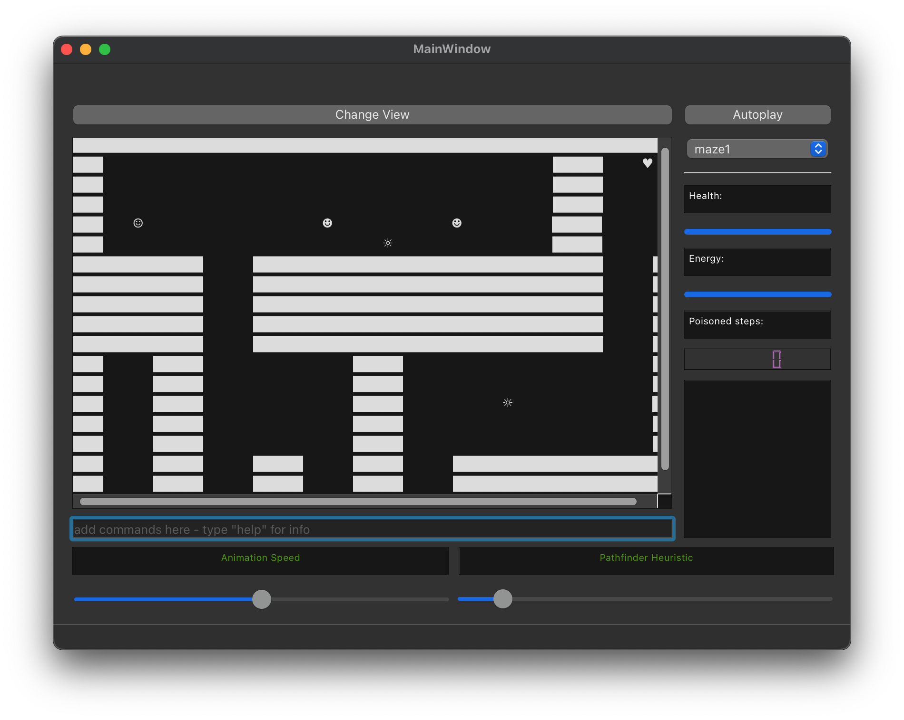

# Final Project Media Processing

## Introduction

This is the final project for the Media Processing course. The goal is to create a game-like application where the protagonist navigates a 2D grid-based world, attacking enemies and gathering health packs. The world can be visualized in 2D graphical and text-based representations. The project follows the MVC design pattern and aims to support easy extension with new enemy types and visualizations.

## Subtasks

- **Subtask A: "Graphical" Representation**: Create the graphical representation using QGraphicsView. Animate protagonist and enemies. Allow manual and automatic navigation with A* pathfinding.

- **Subtask B: "Text-based" Representation**: Implement the text-based representation integrated into the UI. Use commands for protagonist interaction. Consider tab completion for commands.
<!-- insert image in markdown-->

- **Subtask C: Pathfinding**: Implement A* pathfinding algorithm for protagonist navigation in an unknown world.

- **Subtask D: Integration and Extra Features**: Create the UI with switching between views, autoplay mode, XEnemy, and bonus features.

## Library

The project uses the provided header file `include/world.h` and `include/world_global.h` and a shareable library.

## TODOs

### Bugs
#### Text-based representation
- [x] When consuming a health pack, the green background color is removed on next move and not based on the timer.
- [x] The prevCoordinate of the protagonist is not updated when the protagonist moves.
- [ ] The protagonist symbol is not changing to the defeated symbol when the protagonist is defeated. 
- [ ] Switching from the system's dark mode to light mode does not change the background color of the text-based representation. 

#### Other
- [ ] Update poisoned in mainwindow
- [x] Make the maps a class, so that you can add properties like the starting position of the protagonist.
- [ ] Need to test on Linux.
- [ ] Make one of the enemy types that moves randomly. If in the proximity of the protagonist, it will move towards the protagonist. If the protagonist is in the same tile, it will attack the protagonist.
- [ ] Setup the strategy pattern on how to deal with fighting the enemies

### Subtask A: "Graphical" Representation
- [ ] Create the graphical representation of the world using QGraphicsView, QGraphicsScene, and QGraphicsItem.
- [ ] Animate the protagonist and enemies in the graphical view.
- [ ] Implement different visualizations for enemies and their actions, such as attacking and getting defeated.
- [ ] Handle manual navigation of the protagonist using arrow keys.
- [ ] Implement automatic navigation of the protagonist using the A* pathfinding algorithm.
- [ ] Visualize the path followed by the protagonist in "auto" mode.
- [ ] Ensure the architecture allows easy extension for adding new actor types and visualizations.

### Subtask B: "Text-based" Representation
- [x] Finished text-based representation.
- [x] Refactor the code for the controller.
- [x] Implement tab completion for text commands to enhance user experience.
- [x] Add a help command to display a list of all available commands for the protagonist.
- [x] Implement a command history feature to allow users to navigate through previous commands.
- [x] Provide feedback to the user when a command is not recognized or not applicable.
- [x] Add visual cues for the protagonist's health and energy bars in the text-based representation.
- [x] Enhance text animations for protagonist actions, such as attacking and using health packs.
- [x] Allow users to interact with enemies and health packs directly through the text-based representation.
- [ ] Improve input validation for text commands to handle incorrect or invalid input gracefully.
- [ ] Ensure smooth integration between text-based and graphical views.
- [ ] Test and optimize text-based representation for different screen sizes and resolutions.

### Subtask C: Pathfinding
- [ ] Fix and optimize the A* pathfinding algorithm for efficient navigation in an unknown world.
- [ ] Test pathfinding efficiency on the [big maze (2400 x 2380)](resources/world_images/maze3.png) and ensure it completes in a "reasonable" time.
- [ ] Implement a way to avoid unnecessary iteration in the pathfinding algorithm using the specific tile order provided by the library.

### Subtask D: Integration and Extra Features
- [x] Create a user interface with the ability to switch between graphical and text-based views.
- [ ] Implement an autoplay mode with a basic strategy of defeating enemies and finding health packs.
- [x] Introduce a new enemy type, XEnemy, with its own behavior and visualization.
- [ ] Refactor and enhance the code for the controller to support smooth integration of different views and input handling.
- [x] Add health and energy bars visualization for the protagonist in both graphical and text-based views.
- [x] Allow users to control the game's settings, such as the heuristic weight for pathfinding and animation speed.
- [ ] Implement zoom in/out functionality for the graphical view to provide a closer look at the world.

### Bonus
- [ ] Move the settings to a separate window to avoid cluttering the main window.
- [ ] Create more advanced autoplay strategies for better gameplay.
- [ ] Add more animations and visual effects to enhance the gaming experience.
- [ ] Consider implementing additional visual representations as bonus features.
- [ ] Implement a Save/Load system to allow users to save and load their progress.
- [ ] Test the application thoroughly and fix any bugs or issues found during testing.
- [ ] Optimize the performance of the application to ensure smooth gameplay and user experience.
- [ ] Consider implementing a simple mini-map to show the protagonist's location in the world.